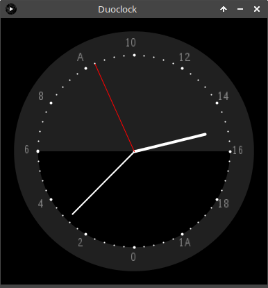

# Duoclock - an interesting twist to your usual clock

   This clock reminds me of the watch I found in the snow in Frost Valley as a kid. That was the coolest watch because it had a "24
   hour" hand, which I thought was awesome.

   Processing3 should be able to compile this for just about any place you want to run it.

## Action shots

   Enjoy the shiny 2D goodness below.

   
